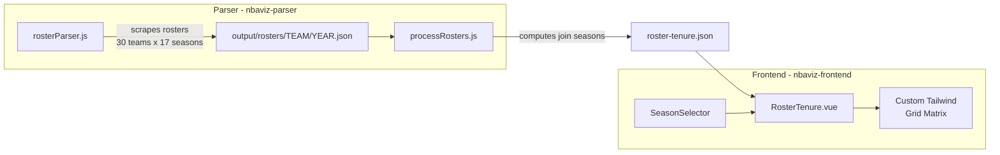

# NBA Roster Tenure Interactive Visualization

> Build an interactive web visualization showing when NBA players joined their current teams (inspired by Lev Akabas's chart), with the ability to browse rosters per season. This involves scraping roster data from basketball-reference.com, processing it to determine player tenure, and rendering a custom Tailwind CSS grid in a new Vue component.

## Tasks

1. **Roster Scraper** -- Create `rosterParser.js` in `nbaviz-parser`: scrape basketball-reference roster pages for 30 teams across 2009-2026 seasons, with team abbreviation mapping and rate limiting
2. **Data Processor** -- Create `processRosters.js`: read raw roster JSONs, compute join seasons (earliest consecutive appearance), handle mid-season gaps, exclude two-way players, output `roster-tenure.json`
3. **Frontend Route** -- Add `/roster-tenure/:season?` route in `router/index.js` and add navigation link in `Header.vue`
4. **Vuex State** -- Add `rosterTenureData` and `rosterTenureSeason` state/mutations/getters to the Vuex store
5. **Tenure Component** -- Build `RosterTenure.vue`: custom Tailwind CSS grid matrix with colored cells, player counts, notable names, team colors, season selector, click-to-expand, hover tooltips, and team sorting by longest tenure

## Architecture Overview



---

## Phase 1: Roster Scraper

Create **`nbaviz-parser/src/rosterParser.js`** following the existing pattern in [`nbaviz-parser/src/parser.js`](nbaviz-parser/src/parser.js):

- Scrape `https://www.basketball-reference.com/teams/{TEAM}/{YEAR}.html` and extract the `#roster` table using Cheerio
- Each page contains: player name, jersey number, position, height, weight, birth date, experience, college
- We only need to extract **player name** and **position** per team per season
- Cover **30 current NBA teams** across **seasons 2009 to 2026** (the `{YEAR}` in the URL is the ending year, e.g. 2025 = 2024-25 season)
- Handle **team abbreviation mapping** between the codebase ([`teams.csv`](nbaviz-backend/server/seeders/teams.csv)) and basketball-reference:
  - `BKN` -> `BRK` (Brooklyn Nets)
  - `PHO` -> `PHX` (Phoenix Suns)
  - `PTB` -> `POR` (Portland Trail Blazers)
  - `NOP` -> `NOP` (Pelicans -- verify; was `NOH` as Hornets pre-2014)
- Output per-team per-season JSON to `nbaviz-parser/output/rosters/{TEAM}/{YEAR}.json`
- Reuse existing helpers: `getWebContent`, `sleep(10000)`, `fileExists`
- Rate limiting: **10-second delay** between requests (~85 min for full scrape)
- Support incremental re-runs (skip existing files)

---

## Phase 2: Data Processing

Create **`nbaviz-parser/src/processRosters.js`** to transform raw roster data into the visualization dataset:

- Read all `output/rosters/{TEAM}/{YEAR}.json` files
- For each team, for each "reference season" (the season the user selects):
  - Get the roster for that season
  - For each player on the roster, walk backwards through seasons to find the **earliest consecutive season** they appeared on that team's roster (= their "join season")
  - Handle the rule from the screenshot: "leaving mid-season and returning next season doesn't interrupt tenure" -- if a player is absent for exactly one season, treat the stint as continuous
- Exclude two-way players (noted in the screenshot)
- Compute the matrix: for each team, for each join-season, the count and list of players
- Sort teams by **longest-tenured player** (earliest join date first, matching the screenshot's order)
- Output a single JSON file to **`nbaviz-frontend/public/data/roster-tenure.json`**:

```json
{
  "seasons": ["2009", "2010", "...", "2026"],
  "data": {
    "2026": {
      "teams": [
        {
          "key": "GSW",
          "name": "Golden State Warriors",
          "color": "#1d428a",
          "conference": "W",
          "joinMap": {
            "2009": { "count": 1, "players": [{"name": "Stephen Curry", "pos": "PG"}] },
            "2012": { "count": 1, "players": [{"name": "Draymond Green", "pos": "PF"}] }
          },
          "totalPlayers": 15
        }
      ]
    },
    "2025": { "..." : "..." }
  }
}
```

---

## Phase 3: Frontend -- New Route and Component

### Router ([`nbaviz-frontend/src/router/index.js`](nbaviz-frontend/src/router/index.js))

- Add new route: `/roster-tenure/:season?` pointing to `RosterTenure.vue`

### Vuex Store ([`nbaviz-frontend/src/store/store.js`](nbaviz-frontend/src/store/store.js))

- Add `rosterTenureData` state to hold the loaded JSON
- Add `rosterTenureSeason` state for the selected season

### New Component: `nbaviz-frontend/src/components/RosterTenure.vue`

Custom HTML/CSS grid with Tailwind, structured as:

- **Header row**: season labels (`'09`, `'10`, ..., `'25`) as column headers
- **Team rows** (one per NBA team, sorted by longest tenure):
  - Left side: optional annotations (like "Brooklyn has 8 new players in 2025-26")
  - Grid cells: colored squares showing player count, with **color intensity** mapped to count (0 = empty, 1 = lightest, 5+ = darkest) using a warm palette (beige -> amber -> deep orange, matching the screenshot)
  - Some cells show **notable player names** (e.g. longest-tenured player for the team) -- for cells with 1-2 players, show names directly
  - Right side: team name and a colored dot matching team color
- **Season selector** (reuse pattern from [`SeasonSelection.vue`](nbaviz-frontend/src/components/partials/SeasonSelection.vue)): dropdown or slider to pick which season's roster to analyze
- **Interactive features**:
  - **Click on a cell** -> expand/modal showing the full list of players who joined in that season (name, position)
  - **Hover tooltip** showing player names and count
  - **Click on a team name** -> navigate to a detail view showing that team's full roster for the selected season with join-season info
- **Footer**: notes about exclusions (two-way players, mid-season leaving rule)

### Navigation

- Add link to the new page in [`Header.vue`](nbaviz-frontend/src/components/partials/Header.vue)

---

## Key Considerations

- **Scraping volume**: ~510 pages total with 10s rate limiting = ~85 minutes for a full scrape. Should only need to run once per season, with incremental updates.
- **Static JSON vs DB**: Start with a static JSON file in `public/data/` to avoid database schema changes. The file will be ~200-500KB and can be loaded on component mount. Can migrate to GraphQL/MySQL later if needed.
- **Two-way players**: basketball-reference marks two-way contract players; the scraper should flag them for exclusion.
- **Team history**: Teams like Brooklyn Nets (was New Jersey Nets), Charlotte (Bobcats/Hornets), OKC (was Seattle SuperSonics) need careful handling -- only track the current franchise identity.
